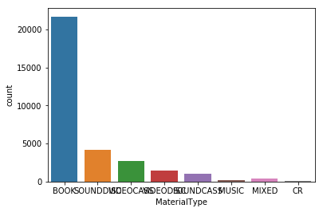
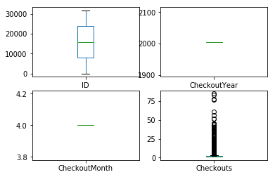
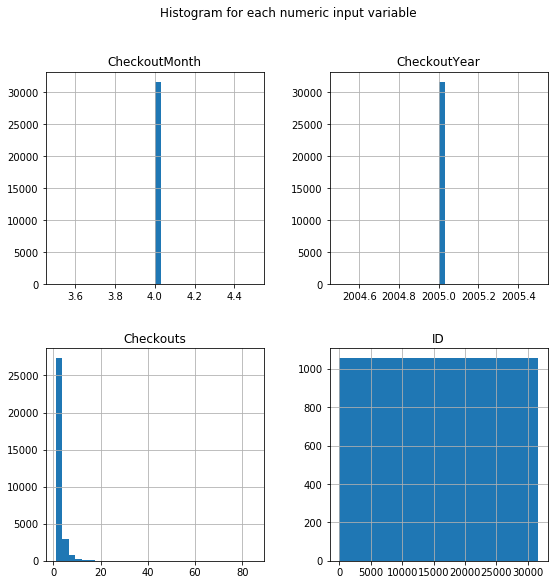

```python
import pandas as pd
```


```python
publish_file_path='E:/ml/train_file.csv'
publish_data=pd.read_csv(publish_file_path)
publish_data.describe()
```


<div>
<style>
    .dataframe thead tr:only-child th {
        text-align: right;
    }

    .dataframe thead th {
        text-align: left;
    }

    .dataframe tbody tr th {
        vertical-align: top;
    }
</style>
<table border="1" class="dataframe">
  <thead>
    <tr style="text-align: right;">
      <th></th>
      <th>ID</th>
      <th>CheckoutYear</th>
      <th>CheckoutMonth</th>
      <th>Checkouts</th>
    </tr>
  </thead>
  <tbody>
    <tr>
      <th>count</th>
      <td>31653.000000</td>
      <td>31653.0</td>
      <td>31653.0</td>
      <td>31653.000000</td>
    </tr>
    <tr>
      <th>mean</th>
      <td>15827.000000</td>
      <td>2005.0</td>
      <td>4.0</td>
      <td>2.117430</td>
    </tr>
    <tr>
      <th>std</th>
      <td>9137.578372</td>
      <td>0.0</td>
      <td>0.0</td>
      <td>2.629428</td>
    </tr>
    <tr>
      <th>min</th>
      <td>1.000000</td>
      <td>2005.0</td>
      <td>4.0</td>
      <td>1.000000</td>
    </tr>
    <tr>
      <th>25%</th>
      <td>7914.000000</td>
      <td>2005.0</td>
      <td>4.0</td>
      <td>1.000000</td>
    </tr>
    <tr>
      <th>50%</th>
      <td>15827.000000</td>
      <td>2005.0</td>
      <td>4.0</td>
      <td>1.000000</td>
    </tr>
    <tr>
      <th>75%</th>
      <td>23740.000000</td>
      <td>2005.0</td>
      <td>4.0</td>
      <td>2.000000</td>
    </tr>
    <tr>
      <th>max</th>
      <td>31653.000000</td>
      <td>2005.0</td>
      <td>4.0</td>
      <td>85.000000</td>
    </tr>
  </tbody>
</table>
</div>


```python
publish_data.head()
```


<div>
<style>
    .dataframe thead tr:only-child th {
        text-align: right;
    }

    .dataframe thead th {
        text-align: left;
    }

    .dataframe tbody tr th {
        vertical-align: top;
    }
</style>
<table border="1" class="dataframe">
  <thead>
    <tr style="text-align: right;">
      <th></th>
      <th>ID</th>
      <th>UsageClass</th>
      <th>CheckoutType</th>
      <th>CheckoutYear</th>
      <th>CheckoutMonth</th>
      <th>Checkouts</th>
      <th>Title</th>
      <th>Creator</th>
      <th>Subjects</th>
      <th>Publisher</th>
      <th>PublicationYear</th>
      <th>MaterialType</th>
    </tr>
  </thead>
  <tbody>
    <tr>
      <th>0</th>
      <td>1</td>
      <td>Physical</td>
      <td>Horizon</td>
      <td>2005</td>
      <td>4</td>
      <td>1</td>
      <td>Tidal wave</td>
      <td>NaN</td>
      <td>Tsunamis, Tsunamis Juvenile literature</td>
      <td>NaN</td>
      <td>NaN</td>
      <td>BOOK</td>
    </tr>
    <tr>
      <th>1</th>
      <td>2</td>
      <td>Physical</td>
      <td>Horizon</td>
      <td>2005</td>
      <td>4</td>
      <td>1</td>
      <td>London holiday / Richard Peck.</td>
      <td>Peck, Richard, 1934-</td>
      <td>NaN</td>
      <td>Viking,</td>
      <td>1998.</td>
      <td>BOOK</td>
    </tr>
    <tr>
      <th>2</th>
      <td>3</td>
      <td>Physical</td>
      <td>Horizon</td>
      <td>2005</td>
      <td>4</td>
      <td>3</td>
      <td>Cinco de Mayo : celebrating Hispanic pride / C...</td>
      <td>Gnojewski, Carol</td>
      <td>Cinco de Mayo Mexican holiday History Juvenile...</td>
      <td>Enslow Publishers,</td>
      <td>c2002.</td>
      <td>BOOK</td>
    </tr>
    <tr>
      <th>3</th>
      <td>4</td>
      <td>Physical</td>
      <td>Horizon</td>
      <td>2005</td>
      <td>4</td>
      <td>1</td>
      <td>Annapolis</td>
      <td>NaN</td>
      <td>War stories, Historical fiction, Domestic fict...</td>
      <td>NaN</td>
      <td>NaN</td>
      <td>BOOK</td>
    </tr>
    <tr>
      <th>4</th>
      <td>5</td>
      <td>Physical</td>
      <td>Horizon</td>
      <td>2005</td>
      <td>4</td>
      <td>1</td>
      <td>As a man thinketh</td>
      <td>NaN</td>
      <td>Thought and thinking</td>
      <td>NaN</td>
      <td>NaN</td>
      <td>BOOK</td>
    </tr>
  </tbody>
</table>
</div>


```python
publish_data.tail()
```


<div>
<style>
    .dataframe thead tr:only-child th {
        text-align: right;
    }

    .dataframe thead th {
        text-align: left;
    }

    .dataframe tbody tr th {
        vertical-align: top;
    }
</style>
<table border="1" class="dataframe">
  <thead>
    <tr style="text-align: right;">
      <th></th>
      <th>ID</th>
      <th>UsageClass</th>
      <th>CheckoutType</th>
      <th>CheckoutYear</th>
      <th>CheckoutMonth</th>
      <th>Checkouts</th>
      <th>Title</th>
      <th>Creator</th>
      <th>Subjects</th>
      <th>Publisher</th>
      <th>PublicationYear</th>
      <th>MaterialType</th>
    </tr>
  </thead>
  <tbody>
    <tr>
      <th>31648</th>
      <td>31649</td>
      <td>Physical</td>
      <td>Horizon</td>
      <td>2005</td>
      <td>4</td>
      <td>2</td>
      <td>California camping</td>
      <td>NaN</td>
      <td>California Guidebooks, Camp sites facilities e...</td>
      <td>NaN</td>
      <td>NaN</td>
      <td>BOOK</td>
    </tr>
    <tr>
      <th>31649</th>
      <td>31650</td>
      <td>Physical</td>
      <td>Horizon</td>
      <td>2005</td>
      <td>4</td>
      <td>5</td>
      <td>silent world of Nicholas Quinn</td>
      <td>NaN</td>
      <td>Morse Inspector Fictitious character Drama</td>
      <td>NaN</td>
      <td>NaN</td>
      <td>VIDEOCASS</td>
    </tr>
    <tr>
      <th>31650</th>
      <td>31651</td>
      <td>Physical</td>
      <td>Horizon</td>
      <td>2005</td>
      <td>4</td>
      <td>12</td>
      <td>big Lebowski</td>
      <td>NaN</td>
      <td>Video recordings for the hearing impaired, Fea...</td>
      <td>NaN</td>
      <td>NaN</td>
      <td>VIDEODISC</td>
    </tr>
    <tr>
      <th>31651</th>
      <td>31652</td>
      <td>Physical</td>
      <td>Horizon</td>
      <td>2005</td>
      <td>4</td>
      <td>4</td>
      <td>Fables. [3], Storybook love / Bill Willingham,...</td>
      <td>Willingham, Bill</td>
      <td>Fairy tales Comic books strips etc, Graphic no...</td>
      <td>DC Comics,</td>
      <td>c2004.</td>
      <td>BOOK</td>
    </tr>
    <tr>
      <th>31652</th>
      <td>31653</td>
      <td>Physical</td>
      <td>Horizon</td>
      <td>2005</td>
      <td>4</td>
      <td>2</td>
      <td>ILLM HIGHER COMMAND</td>
      <td>NaN</td>
      <td>NaN</td>
      <td>NaN</td>
      <td>NaN</td>
      <td>MIXED</td>
    </tr>
  </tbody>
</table>
</div>


```python
import plotly.plotly as py
import plotly.graph_objs as go
from plotly.offline import iplot,init_notebook_mode
```


```python
publish_data.columns
```


    Index(['ID', 'UsageClass', 'CheckoutType', 'CheckoutYear', 'CheckoutMonth',
           'Checkouts', 'Title', 'Creator', 'Subjects', 'Publisher',
           'PublicationYear', 'MaterialType'],
          dtype='object')


```python
publish_data.describe()
```


<div>
<style>
    .dataframe thead tr:only-child th {
        text-align: right;
    }

    .dataframe thead th {
        text-align: left;
    }

    .dataframe tbody tr th {
        vertical-align: top;
    }
</style>
<table border="1" class="dataframe">
  <thead>
    <tr style="text-align: right;">
      <th></th>
      <th>ID</th>
      <th>CheckoutYear</th>
      <th>CheckoutMonth</th>
      <th>Checkouts</th>
    </tr>
  </thead>
  <tbody>
    <tr>
      <th>count</th>
      <td>31653.000000</td>
      <td>31653.0</td>
      <td>31653.0</td>
      <td>31653.000000</td>
    </tr>
    <tr>
      <th>mean</th>
      <td>15827.000000</td>
      <td>2005.0</td>
      <td>4.0</td>
      <td>2.117430</td>
    </tr>
    <tr>
      <th>std</th>
      <td>9137.578372</td>
      <td>0.0</td>
      <td>0.0</td>
      <td>2.629428</td>
    </tr>
    <tr>
      <th>min</th>
      <td>1.000000</td>
      <td>2005.0</td>
      <td>4.0</td>
      <td>1.000000</td>
    </tr>
    <tr>
      <th>25%</th>
      <td>7914.000000</td>
      <td>2005.0</td>
      <td>4.0</td>
      <td>1.000000</td>
    </tr>
    <tr>
      <th>50%</th>
      <td>15827.000000</td>
      <td>2005.0</td>
      <td>4.0</td>
      <td>1.000000</td>
    </tr>
    <tr>
      <th>75%</th>
      <td>23740.000000</td>
      <td>2005.0</td>
      <td>4.0</td>
      <td>2.000000</td>
    </tr>
    <tr>
      <th>max</th>
      <td>31653.000000</td>
      <td>2005.0</td>
      <td>4.0</td>
      <td>85.000000</td>
    </tr>
  </tbody>
</table>
</div>


```python
y=publish_data.MaterialType
```


```python
publish_features=['CheckoutYear', 'CheckoutMonth', 'Checkouts']
```


```python
x=publish_data[publish_features]
```


```python
x.describe()
```


<div>
<style>
    .dataframe thead tr:only-child th {
        text-align: right;
    }

    .dataframe thead th {
        text-align: left;
    }

    .dataframe tbody tr th {
        vertical-align: top;
    }
</style>
<table border="1" class="dataframe">
  <thead>
    <tr style="text-align: right;">
      <th></th>
      <th>CheckoutYear</th>
      <th>CheckoutMonth</th>
      <th>Checkouts</th>
    </tr>
  </thead>
  <tbody>
    <tr>
      <th>count</th>
      <td>8043.0</td>
      <td>8043.0</td>
      <td>8043.000000</td>
    </tr>
    <tr>
      <th>mean</th>
      <td>2005.0</td>
      <td>4.0</td>
      <td>2.244809</td>
    </tr>
    <tr>
      <th>std</th>
      <td>0.0</td>
      <td>0.0</td>
      <td>2.736659</td>
    </tr>
    <tr>
      <th>min</th>
      <td>2005.0</td>
      <td>4.0</td>
      <td>1.000000</td>
    </tr>
    <tr>
      <th>25%</th>
      <td>2005.0</td>
      <td>4.0</td>
      <td>1.000000</td>
    </tr>
    <tr>
      <th>50%</th>
      <td>2005.0</td>
      <td>4.0</td>
      <td>1.000000</td>
    </tr>
    <tr>
      <th>75%</th>
      <td>2005.0</td>
      <td>4.0</td>
      <td>2.000000</td>
    </tr>
    <tr>
      <th>max</th>
      <td>2005.0</td>
      <td>4.0</td>
      <td>84.000000</td>
    </tr>
  </tbody>
</table>
</div>


```python
x.head()
```


<div>
<style>
    .dataframe thead tr:only-child th {
        text-align: right;
    }

    .dataframe thead th {
        text-align: left;
    }

    .dataframe tbody tr th {
        vertical-align: top;
    }
</style>
<table border="1" class="dataframe">
  <thead>
    <tr style="text-align: right;">
      <th></th>
      <th>CheckoutYear</th>
      <th>CheckoutMonth</th>
      <th>Checkouts</th>
    </tr>
  </thead>
  <tbody>
    <tr>
      <th>2</th>
      <td>2005</td>
      <td>4</td>
      <td>3</td>
    </tr>
    <tr>
      <th>5</th>
      <td>2005</td>
      <td>4</td>
      <td>4</td>
    </tr>
    <tr>
      <th>10</th>
      <td>2005</td>
      <td>4</td>
      <td>1</td>
    </tr>
    <tr>
      <th>11</th>
      <td>2005</td>
      <td>4</td>
      <td>3</td>
    </tr>
    <tr>
      <th>12</th>
      <td>2005</td>
      <td>4</td>
      <td>1</td>
    </tr>
  </tbody>
</table>
</div>


# wrong model used, it should be classification


```python
# from sklearn.tree import DecisionTreeRegressor #wrong model
```


```python
publish_model = DecisionTreeRegressor(random_state=1)
```


```python
publish_model.fit(x,y)
```


    ---------------------------------------------------------------------------

    ValueError                                Traceback (most recent call last)

    <ipython-input-38-d093b8d71476> in <module>()
    ----> 1 publish_model.fit(x,y)
    

    C:\ProgramData\Anaconda3\lib\site-packages\sklearn\tree\tree.py in fit(self, X, y, sample_weight, check_input, X_idx_sorted)
       1122             sample_weight=sample_weight,
       1123             check_input=check_input,
    -> 1124             X_idx_sorted=X_idx_sorted)
       1125         return self
       1126 
    

    C:\ProgramData\Anaconda3\lib\site-packages\sklearn\tree\tree.py in fit(self, X, y, sample_weight, check_input, X_idx_sorted)
        166 
        167         if getattr(y, "dtype", None) != DOUBLE or not y.flags.contiguous:
    --> 168             y = np.ascontiguousarray(y, dtype=DOUBLE)
        169 
        170         # Check parameters
    

    C:\ProgramData\Anaconda3\lib\site-packages\numpy\core\numeric.py in ascontiguousarray(a, dtype)
        618 
        619     """
    --> 620     return array(a, dtype, copy=False, order='C', ndmin=1)
        621 
        622 
    

    ValueError: could not convert string to float: 'BOOK'


```python
%matplotlib inline
```


```python
import matplotlib.pyplot as plt
```


```python
publish_data.describe()
```


<div>
<style>
    .dataframe thead tr:only-child th {
        text-align: right;
    }

    .dataframe thead th {
        text-align: left;
    }

    .dataframe tbody tr th {
        vertical-align: top;
    }
</style>
<table border="1" class="dataframe">
  <thead>
    <tr style="text-align: right;">
      <th></th>
      <th>ID</th>
      <th>CheckoutYear</th>
      <th>CheckoutMonth</th>
      <th>Checkouts</th>
    </tr>
  </thead>
  <tbody>
    <tr>
      <th>count</th>
      <td>31653.000000</td>
      <td>31653.0</td>
      <td>31653.0</td>
      <td>31653.000000</td>
    </tr>
    <tr>
      <th>mean</th>
      <td>15827.000000</td>
      <td>2005.0</td>
      <td>4.0</td>
      <td>2.117430</td>
    </tr>
    <tr>
      <th>std</th>
      <td>9137.578372</td>
      <td>0.0</td>
      <td>0.0</td>
      <td>2.629428</td>
    </tr>
    <tr>
      <th>min</th>
      <td>1.000000</td>
      <td>2005.0</td>
      <td>4.0</td>
      <td>1.000000</td>
    </tr>
    <tr>
      <th>25%</th>
      <td>7914.000000</td>
      <td>2005.0</td>
      <td>4.0</td>
      <td>1.000000</td>
    </tr>
    <tr>
      <th>50%</th>
      <td>15827.000000</td>
      <td>2005.0</td>
      <td>4.0</td>
      <td>1.000000</td>
    </tr>
    <tr>
      <th>75%</th>
      <td>23740.000000</td>
      <td>2005.0</td>
      <td>4.0</td>
      <td>2.000000</td>
    </tr>
    <tr>
      <th>max</th>
      <td>31653.000000</td>
      <td>2005.0</td>
      <td>4.0</td>
      <td>85.000000</td>
    </tr>
  </tbody>
</table>
</div>


```python
print(publish_data.shape)
```

    (31653, 12)
    


```python
publish_data.head(20)
```


<div>
<style>
    .dataframe thead tr:only-child th {
        text-align: right;
    }

    .dataframe thead th {
        text-align: left;
    }

    .dataframe tbody tr th {
        vertical-align: top;
    }
</style>
<table border="1" class="dataframe">
  <thead>
    <tr style="text-align: right;">
      <th></th>
      <th>ID</th>
      <th>UsageClass</th>
      <th>CheckoutType</th>
      <th>CheckoutYear</th>
      <th>CheckoutMonth</th>
      <th>Checkouts</th>
      <th>Title</th>
      <th>Creator</th>
      <th>Subjects</th>
      <th>Publisher</th>
      <th>PublicationYear</th>
      <th>MaterialType</th>
    </tr>
  </thead>
  <tbody>
    <tr>
      <th>0</th>
      <td>1</td>
      <td>Physical</td>
      <td>Horizon</td>
      <td>2005</td>
      <td>4</td>
      <td>1</td>
      <td>Tidal wave</td>
      <td>NaN</td>
      <td>Tsunamis, Tsunamis Juvenile literature</td>
      <td>NaN</td>
      <td>NaN</td>
      <td>BOOK</td>
    </tr>
    <tr>
      <th>1</th>
      <td>2</td>
      <td>Physical</td>
      <td>Horizon</td>
      <td>2005</td>
      <td>4</td>
      <td>1</td>
      <td>London holiday / Richard Peck.</td>
      <td>Peck, Richard, 1934-</td>
      <td>NaN</td>
      <td>Viking,</td>
      <td>1998.</td>
      <td>BOOK</td>
    </tr>
    <tr>
      <th>2</th>
      <td>3</td>
      <td>Physical</td>
      <td>Horizon</td>
      <td>2005</td>
      <td>4</td>
      <td>3</td>
      <td>Cinco de Mayo : celebrating Hispanic pride / C...</td>
      <td>Gnojewski, Carol</td>
      <td>Cinco de Mayo Mexican holiday History Juvenile...</td>
      <td>Enslow Publishers,</td>
      <td>c2002.</td>
      <td>BOOK</td>
    </tr>
    <tr>
      <th>3</th>
      <td>4</td>
      <td>Physical</td>
      <td>Horizon</td>
      <td>2005</td>
      <td>4</td>
      <td>1</td>
      <td>Annapolis</td>
      <td>NaN</td>
      <td>War stories, Historical fiction, Domestic fict...</td>
      <td>NaN</td>
      <td>NaN</td>
      <td>BOOK</td>
    </tr>
    <tr>
      <th>4</th>
      <td>5</td>
      <td>Physical</td>
      <td>Horizon</td>
      <td>2005</td>
      <td>4</td>
      <td>1</td>
      <td>As a man thinketh</td>
      <td>NaN</td>
      <td>Thought and thinking</td>
      <td>NaN</td>
      <td>NaN</td>
      <td>BOOK</td>
    </tr>
    <tr>
      <th>5</th>
      <td>6</td>
      <td>Physical</td>
      <td>Horizon</td>
      <td>2005</td>
      <td>4</td>
      <td>4</td>
      <td>Minnie and Moo go dancing / [written and illus...</td>
      <td>Cazet, Denys</td>
      <td>Cows Juvenile fiction, Parties Fiction, Farm l...</td>
      <td>DK Pub.,</td>
      <td>c1998.</td>
      <td>BOOK</td>
    </tr>
    <tr>
      <th>6</th>
      <td>7</td>
      <td>Physical</td>
      <td>Horizon</td>
      <td>2005</td>
      <td>4</td>
      <td>1</td>
      <td>cat who robbed a bank</td>
      <td>NaN</td>
      <td>Mystery fiction, Qwilleran Jim Fictitious char...</td>
      <td>NaN</td>
      <td>NaN</td>
      <td>BOOK</td>
    </tr>
    <tr>
      <th>7</th>
      <td>8</td>
      <td>Physical</td>
      <td>Horizon</td>
      <td>2005</td>
      <td>4</td>
      <td>1</td>
      <td>Irwin guide to using the Wall Street journal</td>
      <td>NaN</td>
      <td>Wall Street journal, Investments United States...</td>
      <td>NaN</td>
      <td>NaN</td>
      <td>BOOK</td>
    </tr>
    <tr>
      <th>8</th>
      <td>9</td>
      <td>Physical</td>
      <td>Horizon</td>
      <td>2005</td>
      <td>4</td>
      <td>4</td>
      <td>Oracle night</td>
      <td>NaN</td>
      <td>Novelists American New York State New York Fic...</td>
      <td>NaN</td>
      <td>NaN</td>
      <td>BOOK</td>
    </tr>
    <tr>
      <th>9</th>
      <td>10</td>
      <td>Physical</td>
      <td>Horizon</td>
      <td>2005</td>
      <td>4</td>
      <td>1</td>
      <td>12 haunted episodes</td>
      <td>NaN</td>
      <td>Rock music 1991 2000</td>
      <td>NaN</td>
      <td>NaN</td>
      <td>SOUNDDISC</td>
    </tr>
    <tr>
      <th>10</th>
      <td>11</td>
      <td>Physical</td>
      <td>Horizon</td>
      <td>2005</td>
      <td>4</td>
      <td>1</td>
      <td>The Roman army, 31 BC-AD 337 : a sourcebook / ...</td>
      <td>Campbell, J. B.</td>
      <td>Rome Italy Army</td>
      <td>Routledge,</td>
      <td>1994.</td>
      <td>BOOK</td>
    </tr>
    <tr>
      <th>11</th>
      <td>12</td>
      <td>Physical</td>
      <td>Horizon</td>
      <td>2005</td>
      <td>4</td>
      <td>3</td>
      <td>The Ink Spots [sound recording].</td>
      <td>Ink Spots (Musical group)</td>
      <td>Popular music 1931 1940, Popular music 1941 1950</td>
      <td>MCA,</td>
      <td>p1999.</td>
      <td>SOUNDDISC</td>
    </tr>
    <tr>
      <th>12</th>
      <td>13</td>
      <td>Physical</td>
      <td>Horizon</td>
      <td>2005</td>
      <td>4</td>
      <td>1</td>
      <td>First 24 hours of war in the Pacific / by Dona...</td>
      <td>Young, Donald J., 1930-</td>
      <td>World War 1939 1945 Campaigns Pacific Area</td>
      <td>Burd Street Press,</td>
      <td>c1998.</td>
      <td>BOOK</td>
    </tr>
    <tr>
      <th>13</th>
      <td>14</td>
      <td>Physical</td>
      <td>Horizon</td>
      <td>2005</td>
      <td>4</td>
      <td>1</td>
      <td>Where do birds live</td>
      <td>NaN</td>
      <td>Birds Habitat Juvenile literature, Birds Habitat</td>
      <td>NaN</td>
      <td>NaN</td>
      <td>BOOK</td>
    </tr>
    <tr>
      <th>14</th>
      <td>15</td>
      <td>Physical</td>
      <td>Horizon</td>
      <td>2005</td>
      <td>4</td>
      <td>2</td>
      <td>Doctor Who The pirate planet</td>
      <td>NaN</td>
      <td>Video recordings for the hearing impaired, Sci...</td>
      <td>NaN</td>
      <td>NaN</td>
      <td>VIDEOCASS</td>
    </tr>
    <tr>
      <th>15</th>
      <td>16</td>
      <td>Physical</td>
      <td>Horizon</td>
      <td>2005</td>
      <td>4</td>
      <td>2</td>
      <td>Australia a cultural history</td>
      <td>NaN</td>
      <td>Australia Civilization</td>
      <td>NaN</td>
      <td>NaN</td>
      <td>BOOK</td>
    </tr>
    <tr>
      <th>16</th>
      <td>17</td>
      <td>Physical</td>
      <td>Horizon</td>
      <td>2005</td>
      <td>4</td>
      <td>2</td>
      <td>Be afraid tales of horror</td>
      <td>NaN</td>
      <td>Horror tales American, Childrens stories American</td>
      <td>NaN</td>
      <td>NaN</td>
      <td>BOOK</td>
    </tr>
    <tr>
      <th>17</th>
      <td>18</td>
      <td>Physical</td>
      <td>Horizon</td>
      <td>2005</td>
      <td>4</td>
      <td>1</td>
      <td>country under my skin a memoir of love and war</td>
      <td>NaN</td>
      <td>Revolutionaries Nicaragua Biography, Nicaragua...</td>
      <td>NaN</td>
      <td>NaN</td>
      <td>BOOK</td>
    </tr>
    <tr>
      <th>18</th>
      <td>19</td>
      <td>Physical</td>
      <td>Horizon</td>
      <td>2005</td>
      <td>4</td>
      <td>1</td>
      <td>Giai đoạn mới trên chiến trường cũ / Nguyễn Hữ...</td>
      <td>Nguyẽn, Hữu Nghĩa</td>
      <td>Vietnam Politics and government 1975</td>
      <td>Làng Văn,</td>
      <td>1999.</td>
      <td>BOOK</td>
    </tr>
    <tr>
      <th>19</th>
      <td>20</td>
      <td>Physical</td>
      <td>Horizon</td>
      <td>2005</td>
      <td>4</td>
      <td>16</td>
      <td>Wild about books / by Judy Sierra ; illustrate...</td>
      <td>Sierra, Judy</td>
      <td>Zoo animals Juvenile fiction, Books and readin...</td>
      <td>Knopf,</td>
      <td>2004.</td>
      <td>BOOK</td>
    </tr>
  </tbody>
</table>
</div>


```python
print(publish_data.MaterialType.unique())
```

    ['BOOK' 'SOUNDDISC' 'VIDEOCASS' 'VIDEODISC' 'SOUNDCASS' 'MUSIC' 'MIXED'
     'CR']
    


```python
publish_data.groupby('MaterialType').size()
```


    MaterialType
    BOOK         21707
    CR              94
    MIXED          347
    MUSIC          165
    SOUNDCASS     1020
    SOUNDDISC     4149
    VIDEOCASS     2751
    VIDEODISC     1420
    dtype: int64


```python
import seaborn as sns
```


```python
sns.countplot(publish_data['MaterialType'],label='Count')
```


    <matplotlib.axes._subplots.AxesSubplot at 0xd9ef410>





```python
publish_data.drop('MaterialType', axis=1).plot(kind='box', subplots=True, layout=(2,2), sharex=False, sharey=False)
plt.savefig('publish_box')
plt.show()
```





```python
import pylab as pl
publish_data.drop('MaterialType' ,axis=1).hist(bins=30, figsize=(9,9))
pl.suptitle("Histogram for each numeric input variable")
plt.savefig('publish_hist')
plt.show()
```





```python
publish_data.columns
```


    Index(['ID', 'UsageClass', 'CheckoutType', 'CheckoutYear', 'CheckoutMonth',
           'Checkouts', 'Title', 'Creator', 'Subjects', 'Publisher',
           'PublicationYear', 'MaterialType'],
          dtype='object')


```python
print(publish_data.UsageClass.unique())
```

    ['Physical']
    


```python
print(publish_data.Subjects)
```

    0                   Tsunamis, Tsunamis Juvenile literature
    1                                                      NaN
    2        Cinco de Mayo Mexican holiday History Juvenile...
    3        War stories, Historical fiction, Domestic fict...
    4                                     Thought and thinking
    5        Cows Juvenile fiction, Parties Fiction, Farm l...
    6        Mystery fiction, Qwilleran Jim Fictitious char...
    7        Wall Street journal, Investments United States...
    8        Novelists American New York State New York Fic...
    9                                     Rock music 1991 2000
    10                                         Rome Italy Army
    11        Popular music 1931 1940, Popular music 1941 1950
    12              World War 1939 1945 Campaigns Pacific Area
    13        Birds Habitat Juvenile literature, Birds Habitat
    14       Video recordings for the hearing impaired, Sci...
    15                                  Australia Civilization
    16       Horror tales American, Childrens stories American
    17       Revolutionaries Nicaragua Biography, Nicaragua...
    18                    Vietnam Politics and government 1975
    19       Zoo animals Juvenile fiction, Books and readin...
    20                                            Reggae music
    21       Video recordings for the hearing impaired, Tel...
    22       Popular music 1991 2000, Rap Music, Black Musl...
    23       Rock music 2001 2010, Popular instrumental mus...
    24       England Drama, Women England Drama, Lucia Fict...
    25       Animals Fiction, Ghosts Fiction, Hockey Fictio...
    26       Feature films, African American women Drama, A...
    27                                           Feature films
    28       Fantasy fiction, Revenge Fiction, Dragons Fict...
    29       Chinese language Sound recordings for English ...
                                   ...                        
    31623    Garc¡a M rquez Gabriel 1928 Translations into ...
    31624             Cookery American, Angelou Maya Anecdotes
    31625    Sylvester 1947 1988, Singers United States Bio...
    31626    Brothers and sisters Fiction, Repression Psych...
    31627    Spies Biography, Espionage Encyclopedias, Inte...
    31628                                      Sonnets English
    31629    Randall Sunny Fictitious character Fiction, Wo...
    31630    Schools Fiction, Dragons Fiction, Self actuali...
    31631     English language Punctuation Juvenile literature
    31632    Levy Marvin Diaries, World War 1939 1945 Campa...
    31633    Architecture United States Examinations Study ...
    31634    Christian fiction, Biographical fiction, Jesus...
    31635    Large type books, Mystery fiction, Missouri Fi...
    31636                        Arab Israeli conflict Sources
    31637    Criminal justice Administration of Washington ...
    31638    Video recordings for the hearing impaired, Fea...
    31639                             New business enterprises
    31640                                      Schools Fiction
    31641    Humorous stories, Brothers and sisters Fiction...
    31642                                                  NaN
    31643    Stackhouse Sookie Fictitious character Fiction...
    31644                                      Witches Fiction
    31645    Solomon King of Israel, Jews Folklore, Solomon...
    31646    Video recordings for the hearing impaired, Jam...
    31647    Medicine Ayurvedic, Hair preparations, Hair Ca...
    31648    California Guidebooks, Camp sites facilities e...
    31649           Morse Inspector Fictitious character Drama
    31650    Video recordings for the hearing impaired, Fea...
    31651    Fairy tales Comic books strips etc, Graphic no...
    31652                                                  NaN
    Name: Subjects, Length: 31653, dtype: object
    


```python
print(publish_data.Creator.unique())
```

    [nan 'Peck, Richard, 1934-' 'Gnojewski, Carol' ..., 'Gamson, Joshua, 1962-'
     'Aos, Steven' 'Willingham, Bill']
    


```python
print(publish_data.PublicationYear.unique())
```

    [nan '1998.' 'c2002.' 'c1998.' '1994.' 'p1999.' '1999.' '2004.' 'p1995.'
     '[1969]' 'c1999.' '[2005],' 'p2003.' '2003.' 'c2001.' 'p1998.' '1974.'
     'c1992.' 'c2003.' '[1989]' 'c2004.' 'p1994.' '1992.' 'p2004.' '[1974]'
     'c1988.' '1995.' '2001.' '2004, c2002.' '2002, c1989.' 'c2000.' 'c1994.'
     '[2001?], p1984.' '1984.' '2002.' '[2003], p1992.' '[1972]' '1993.'
     'c1986.' 'c1997.' 'c1981.' 'c1933.' '2000.' '1927.' 'c2005.'
     '1986, c1969.' '[1955]' '1989.' '[199-?], p1976.' '1975.' '[1990].'
     '[1967]' '1966.' 'pc2002.' '[1999?]' 'c1996.' 'c1977.' '1996.'
     '1963, c1961.' '1997.' 'c1984.' '1893.' 'c1979.' 'p2001.' 'c1995.' '2005.'
     '1991, c1963.' 'p1989.' 'c1990.' 'c1989.' '[1975]' 'c1976.' 'c1991.'
     '[1999]' 'c1985.' '[1998]' '1969.' '2001, c2002.' 'c1983.' '1986.'
     '[1971]' '[1987?]' '[2003]' '2005, c1966.' 'p2002.' '[1984], c1977.'
     '[2002], c1984.' '1980.' '1988.' 'min guo 81 [1992]' '1943.'
     '2003, c2000.' '[1994], p1977.' 'p1992.' '[2004]' '1979, c1978.'
     '[1990?], c1980.' '1924.' '1925.' '1993-' '1976.' '[c1968]' '[1957]'
     'c1959.' '1985.' '[1996]' '1998, c1997.' '1978.' '1979.' 'c1962.' 'c1982.'
     'p1997.' '1957.' 'c2002 [i.e. 2001]' 'c1993.' '1991.' '[1985], p1981.'
     'p1987.' '1993, 2000.' '1967.' '1966 [c1965]' '[2004], c1959.'
     '[1964, c1963]' 'c1980.' '1986, c1985.' '1960.' '2004, c1977.' 'p1990.'
     '[1973]' '[2005]' '[1990]' 'p2000.' 'Heisei 10 [1998].' '[1987]' '1955.'
     '1982.' '1998' '[1970]' '[198-?], p1974.' 'c2005-' '1951.' '1998-'
     '[1988].' '1990.' '[199-?]' '[c1931]' '1996, c1994.' 'c1987.' 'c1978.'
     '[1966]' '1983.' '[1909]' '1973.' '1962.' 'c1934.' '[1962, c1955]'
     'p1996.' '2001-' '[2004], c2000-c2001.' '2001, c1985.' '1995, c1994.'
     '[1967?]' '[2001]' 'c1951.' '[199-?], p1975.' 'p1988.' '[2003], p2001.'
     '2000' '1981.' '1963.' '©1960.' '1921.' '[194-?].' '2000-' '1965.'
     '1989, c1988.' '[1968]' '[1998].' '[1968, c1967]' '[2004], c2002.'
     '[1971, c1970]' '1962-' '[1959]' '[1994?], c1920.' 'c1969-' '[2000]'
     '1970.' 'c1991-' '1959.' 'p1982.' '[1972, c1959]' '[1997]' '2002, c1997.'
     '1950.' 'c1975.' '1983, c1982.' '2004, c2000.' '[1987].' '[2003], c2002.'
     '[1935]' '[1973- c1945-46]' '1987.' '[1962]' '1987, c1986.' '[1963]'
     '[1998?]' 'c1996-' 'p1993.' '2004, c1995.' '1945.' 'c1961.' 'c2004, 2003.'
     '[1952]' '[c2003]' '[1999], c1998.' '[1982]' 'c1995-' '1997, c1998.'
     '1876.' 'Shōwa 56 [1981]' '[c1948]' 'Heisei 12 [2000]' '[2004], c1997.'
     'p1999, c1943.' '[1960]' '[1985?], p1972.' '1973, c1965.' '2001, c1999.'
     '[2000], c1996.' 'c1960.' '1956-1958.' '1996-' '1971.' 'c1989-'
     '[1994], p1992.' 'Shōwa 62 [1987]' '[1997], p1995.' '1939.' 'c1990-'
     'c1973.' '1964.' '1973-1986.' 'c1936.' '1941.' 'c1954.' 'p1986.' '2004?]'
     'p2005.' 'c1970.' '[1994]' '1996, c1968.' '2004, c1990.' '[1992].'
     '[2002]' '1899.' '1983' '[2002], c2005.' 'Min guo 80 [1991]'
     '2000, c1946.' '1977, c1959.' 'c1931.' '1999, c1993.' '2002-' 'c1990'
     '[1961]' 'min guo 86 [1997]' '1986, c1953.' '1979, c1952.' 'p1991.'
     '[c1966-]' '1992-1993.' '1982, c1939.' '[2000].' '2004, c1959.'
     '[2002], c1992.' '[1964]' '2005, c1972.' '[1949]' '[198-?]'
     '[1998], c1970.' 'p2004, c1988.' '1973]' '1958.' '2001, c2000.' '[1965]'
     'min guo 76 [1987]' '[1948]' '[1992]' '[2004], c1983.' '1992, c1965.'
     '1980, c1978.' '[1997], c1991.' 'c1967.' '©1980.' '1988, c1932.' '[2003?]'
     '[1947]' '[198-]' '[1993]' '[198-?-]' '2001,c1964.' '1997, c1996.' '1948.'
     '[2003], c1991.' '1912.' '1986, c1981.' '[1979] c1953.' '[1973, c1972]'
     'c1997-' '[19--?]' '[1987?], p1968.' '[c1930]' '1934.' '1981, c1980.'
     '1988-' '1929.' '2000, c1992.' '1944.' '[1989?], p1970.' '1940.' '[1944]'
     '[1996], c1981.' '1915.' '[c1937]' '[1991].' 'c2000, 2004.'
     '[2004], c2003.' '1996' 'Min guo 79 [1990]' '[2005].' '1960 [c1959]'
     '[1988?]' '1997' '2002, c2001.' '1980, c1976.' '1977.' '1998, c1993.'
     '[1954]' '1989, c1985.' 'c1968.' '1987-' 'c1963.' '[2000] c1999.'
     '[2004], c1974.' '1949.' 'c1974.' '[1994?]' '1999-' '1988, c1936.' '1935.'
     'c1994-' '[1951, c1950]' '[2003], c2001.' '1972.' '1998, c1992.'
     '2003, c2002.' '1960' '1992, c1991.' '1972, c1971.' '[1989], p1960.'
     '[1971, c1968]' '1997-1998.' '[2002], c2001.' '[1994], c1972.' '1968.'
     '1997, c1977.' 'c1987-' '2001, c1992.' '2003-' '2008, c1997.'
     'Min guo 78 [1989]' '1973, c1971.' '[1996].' '[1994-]' '[c1910]' '[c1970]'
     '1910.' '[1956]' '[2000], p1996.' '2004, c2003.' '[2004], c1991.' '1986'
     '[1987?], p1979.' 'Heisei gannen [1988]' '[2003], c1996.' 'c2002-'
     'p1981.' '1895.' '[1914]' '[1998], c1993.' '[c1992], p1989.'
     '1999, c1958.' '[1995].' '1989-' '1976, c1957.' 'c1972.' 'c1985'
     '[1991], p1983.' '1954-<1988 >' '[2003], c2000.' '2000, c1996.'
     '[2000], p1992.' '1997, c1993.' 'c1940.' '2000, c1998.' '2000, c1986.'
     '1991-2003.' '2002, c1991.' '1978-' '1977-1978.' 'cp2002.' '1931.'
     'c2000, 1995.' '1991, c1990.' '[1958]' '1953.' '1952 [c1941]' 'c1985-'
     '[1995], p1987.' '2000, c1999.' 'c1984-' '[1984?], c1915.' '[1951]'
     'p1985.' '2002, c1972.' 'c1938.' '2004, .' '1962, c1957.' '[1972, c1971]'
     'c[2003]' '1994, c1983.' '[198-?], c1975.' 'min guo 80 [1991]' '[1943]'
     '[1997?- ]' '[2002?]' '2002' 'Heisei 10 [1998]' '[2005], c2004.'
     '1968 [c1967]' '[2004], c2001.' '[c1944]' '[1991], p1986.' '[2004].'
     '1870.' '[1989], c1972.' '2003, c1999.' '2004, c1999.' '1978, c1977.'
     '[1985?], p1975.' '1984, c1953.' '[1978]' '[c2001]' '1896.'
     'c2003, p2001, c1969.' '[1995?], c1985.' '1984, c1983.' '[2002], c1986.'
     '[1956-1961]' '1947-c2002.' '[1991]' '1973 [c1972]' '[1999?], p1979.'
     '[200-?]' '[1987?], p1977.' '1973 [c1971]' '[1998], p1996.'
     '[1996], p1976.' '1988, c1987.' '1987, c1984.' '1991, c1987.' 'c1928.'
     '1989, c1979.' '1922.' '[c1973]' 'c1947' '1983, c1970.' '[1905?]'
     '1955 [i.e. 1956]' 'c1953-c1966.' '[1985?], p1984.' '[2004?]'
     '[1988, i.i. 1999]' '[1987?], p1969.' '[c1926-27]' 'Heisei 15 [2003]'
     '2004, c1992.' '1977, c1976.' '2005, c2004.' '[1993?]' '2004, c1955.'
     '[1916]' 'Heisei 2 [1990]' '[1997], p1965.' '1997-' '[1992], p1976.'
     '[2005], c1984.' '[c1955]' '[c1978]' 'min guo 88 [1999]' '1914'
     '1998, c1988.' '1907-1912.' '[1990?]' '[1995]' '2004, c1982.' '1994-'
     '[1996], p1992.' '1973 [c1940]' 'c1978-c1985.' '[1972, c1942]' '1905.'
     '1988, c1986.' '[c1983]' 'c2003-' '1969-<1985>' '1984, c1982.' 'c1930.'
     '1985, c1983.' '1946.' 'p1978.' '[c1964]' 'Heisei 16 [2004]' '1995-'
     '[1960, c1959]' '[18--]' 'c1997, p1990.' '<c1999- >' 'c1980-' '[1988]'
     'p 2002.' '2006.' 'c1943.' 'c1950.' '[c2000]' 'Shōwa 45 (1970)'
     '2003, c2001.' '[198-?], p1978.' 'Heisei 4 [1992]' '[c1902]'
     '1996, c1991.' '1999, c1980.' '[1988], p1966.' '[c1971]' '[c1968, c1970]'
     '[1989], c1990.' '[1953]' '1961, c1960.' '[1985?], c1977.' '1990, c1980.'
     '1994, c1993.' '1975, c1960.' '1981-<1991 >' '[1981]' '[1995?], p1976.'
     '[199-?].' '2001, c1989.' 'c1966.' '[date of publication not identified]'
     'p1995, c1994.' 'c1988-' '[1988], c1952.' '1956-' '[1997?]' '2003, c1972.'
     '[199-?], p1978.' '[199-?], c1959.' '[1992], c1967.' 'c1992-'
     '[1967, c1968]' 'c 2000.' '[1993], p1973.' '1953, c1952.' 'c1998-'
     '1976, c1961.' '[19--]' '[1999], p1978.' '[1998], c1976.' '2002, c2000.'
     '1917, c1916.' '1935, c1924.'
     'min guo 77 [1988] (min guo 81 [1992] printing)' 'p2004, c2011'
     '[between 1983 and 1990], c1970.' '2008, c1994.' '2002, c1999.'
     '1980, c1979.' '1995, ©1993.' 'c2001-' 'p1996, c1961.' '[1990?], p1969.'
     '1993, c1991.' 'Shōwa 58 [1983]' '1994, c1987.' 'p2003, c2002.' 'c1995'
     'c1945.' '1976, c1947.' '1985, c1984.' '1901.' '[2000], p1997.' '[c1997]'
     ',1994.' '[2001], p1989.' 'c2002, p2002.' '[c1939]' 'c1909.' '[c1995].'
     '[1996], c1952' 'c1958.' 'c1889.' '[c1994?]' '1916.' 'c2000' '[1942]'
     '1926.' 'c2000, p1970.' 'c1998, p1977.' '[1988?], p1957.'
     '[199-?], p1982.' '[1900?]' 'c2003-2008 [2003?].' '2004-' '1976-1977.'
     '[1961]-' '[2001?]' '1856.' '[1975] c1957.' '[1989?]' '1952.'
     'p1997, p1996.' '[c1989?]' 'c1997' '2002, c1982.' '1999, c1998.'
     '[19--?].' '2002, 1975.' '[1988?] p1972.' '[1975].' '2005, c1934.'
     '1984, c1978.' '[1992, c1991]' '2001, c1991.' '[1976] c1975.'
     '2003, c1998-1999.' '[c1994].' '1977-1983.' '[1991?], p1965.'
     '1992, c1983.' '[198-], p1978.' 'c1988-c2009.' 'cp2001.' 'c1965.'
     '2002, c1965.' 'Heisei 8 [1996]' '1982, c1983.' '1937.' 'c2000, p1974.'
     'c2002, p1994.' '[c1975]' 'c1960' '[1950]' '[1958?]' '1993-<c1998 >'
     '©2002.' 'c1993-' 'p1997, c1991.' '[1996?], p1979.' '[c1947]'
     '[196-?], c1959.' 'c1906.' '1983, c1967.' '[1990?], p1970.' 'c1999-'
     '1998, c1967.' '1971-' '1960, c1941.' '2005-' 'min guo 53 [1964]'
     'p1977, c1948.' '[p1990], p1989.' '[1985?]' '[2000], c1977.'
     '[1997], p1989.' 'c1937.' '1974, c1969.' '[1998], c1988.' '1975, c1974.'
     '2004, c1960.' 'c1956.' '1999, c1997.' '[c1994]' 'min guo 83 [1994]'
     'c1947.' '[1989], c1961.' '[1990], p1973.' '[c1953]' '1909.' '1923-39.'
     'c1969.' 'c1983-' '[1967, c1925]' '1983, c1938.' '2004, p1990.'
     '2003, c1992.' '1987' '1966]' '[1996?]' '[199-?], p1966.' '[2002], c1983.'
     '[1990?], p1974.' '[2004], c1953.' '1961.' 'c2004-' '1991-' '©1995.'
     '©1989.' '1991-<1996 >' 'p1975.' 'c2001, p1979.' '©2003.'
     '[198-?], c1933.' '[1991?]' '1917.' 'p1976.' '[198-], p1979.'
     '2004, c1968.' '1969, c1962.' '1965 [c1940]' '[1984?]' '©2004.' 'c1971.'
     'Min guo 89 [2000]' '[c1938]' 'p2003, c1967.' '1977-' '1996, c1990.'
     '2013, 2002.' '[1988?].' '1990-' '1976, c1967.' 'c1998' '1982, c1981.'
     '[2001], c1997.' '[2004], c1984.' '[199-?], p1970.' '[2002], c2000.'
     '1913.' '2002, c1992.' '[1999].' '[1984]' '[c1998]' '1907.' 'c1964.'
     '1999' '2002, c1970.' 'c1975-1980.' 'p1977.' '[198-], p1975.'
     'c2000,1985.' '1969' '1994, c1991.' '1987, p1970.' 'c1974'
     'Shōwa 54 [1979]' '[c1957]' '[2000], c2001.' '2006, c1999, c1998.' '2001'
     'c2004-c2009.' '2001, c2001.' '[1987?], p1967.' '1989, c1974.'
     '1981, c1978.' '[between 1986 and 1989]' '1954.' '[1997].' 'c1999, 1980.'
     'c1964-1966.' '[198-?], p1972.' '[1989], c1980.' '[1990?], p1975.'
     '[1983?], c1978.' '[1999?], c1950.' '2004, c2001.' 'p2004, c1975.'
     '1900-1905.' '2003, c1973.' '[2000], c1987.' '[c1969]' '2003, c1955.'
     '1967 [i.e. 1968]' '[between 1994 and 2002]' '1962 [c1961]' '1942.'
     'p1984.' 'cp1998.' '1979' '1983-' '1989, c1949.' '[c1959]' '1995, c1940.'
     'c1978-c2005.' '2000, c1983.' '[1992?]' '[198-], c1976.' '[1945]' 'c1919.'
     '2002,c1999.' '[2000], c1948.' 'c1949.' 'Shōwa 62-63 [1987-1988]'
     '[1987?], p1981.' 'c2003, p1980.' '[199-?], p1972.' '1997,c1927.' '1911.'
     '2003]' '[2000?]' '[1968, c1952]' 'Shōwa 59 [1984]' '1995, c1954.'
     'c2000-' '1993, c1992.' '1989, c1987.' 'p1998, c1987.' '<c1983- >'
     '[1993].' '[1959]-1976.' '[2000?], c1974.' '1997,c1970.' '2004, c1978.'
     '2004, c1991.' 'c1980-c1984.' '2004, c1984.' '[1998?],c1990.'
     '[2005], c1999.' '[1989?], p1972.' '[1985?], c1974.' '1973-1984.' '1938.']
    


```python
print(publish_data.Publisher)
```

    0                                                      NaN
    1                                                  Viking,
    2                                       Enslow Publishers,
    3                                                      NaN
    4                                                      NaN
    5                                                 DK Pub.,
    6                                                      NaN
    7                                                      NaN
    8                                                      NaN
    9                                                      NaN
    10                                              Routledge,
    11                                                    MCA,
    12                                      Burd Street Press,
    13                                                     NaN
    14                                                     NaN
    15                                                     NaN
    16                                                     NaN
    17                                                     NaN
    18                                               Làng Văn,
    19                                                  Knopf,
    20                                                     NaN
    21                                                     NaN
    22       Beggars Banquet/Mammoth Records ; Distributed ...
    23                                                     NaN
    24                                                     NaN
    25                                                     NaN
    26                                                     NaN
    27                                                     NaN
    28                                                     NaN
    29                                                     NaN
                                   ...                        
    31623                            HarperCollins Publishers,
    31624                                                  NaN
    31625                                             H. Holt,
    31626                                        Random House,
    31627                                                  NaN
    31628                                       Little, Brown,
    31629                                              Putnam,
    31630                                                  NaN
    31631                                                  NaN
    31632                                                  NaN
    31633                                                  NaN
    31634                                                  NaN
    31635                                                  NaN
    31636                                                  NaN
    31637        Washington State Institute for Public Policy,
    31638                                                  NaN
    31639                                                  NaN
    31640                        Dial Books for Young Readers,
    31641                                                  NaN
    31642                                                  NaN
    31643                      Ace Books : Berkley Pub. Group,
    31644                                                  NaN
    31645                                                  NaN
    31646                                                  NaN
    31647                                                  NaN
    31648                                                  NaN
    31649                                                  NaN
    31650                                                  NaN
    31651                                           DC Comics,
    31652                                                  NaN
    Name: Publisher, Length: 31653, dtype: object
    


```python
print(publish_data.PublicationYear)
```

    0           NaN
    1         1998.
    2        c2002.
    3           NaN
    4           NaN
    5        c1998.
    6           NaN
    7           NaN
    8           NaN
    9           NaN
    10        1994.
    11       p1999.
    12       c1998.
    13          NaN
    14          NaN
    15          NaN
    16          NaN
    17          NaN
    18        1999.
    19        2004.
    20          NaN
    21          NaN
    22       p1995.
    23          NaN
    24          NaN
    25          NaN
    26          NaN
    27          NaN
    28          NaN
    29          NaN
              ...  
    31623     1999.
    31624       NaN
    31625     2005.
    31626    c2004.
    31627       NaN
    31628     1998.
    31629    c2004.
    31630       NaN
    31631       NaN
    31632       NaN
    31633       NaN
    31634       NaN
    31635       NaN
    31636       NaN
    31637    [2003]
    31638       NaN
    31639       NaN
    31640     2000.
    31641       NaN
    31642       NaN
    31643     2002.
    31644       NaN
    31645       NaN
    31646       NaN
    31647       NaN
    31648       NaN
    31649       NaN
    31650       NaN
    31651    c2004.
    31652       NaN
    Name: PublicationYear, Length: 31653, dtype: object
    


```python
publish_data.isnull().sum(axis = 0)
```


    ID                     0
    UsageClass             0
    CheckoutType           0
    CheckoutYear           0
    CheckoutMonth          0
    Checkouts              0
    Title                  0
    Creator            23137
    Subjects            1763
    Publisher          21916
    PublicationYear    21931
    MaterialType           0
    dtype: int64


```python
print(publish_data.Checkouts,publish_data.MaterialType)
```

    0         1
    1         1
    2         3
    3         1
    4         1
    5         4
    6         1
    7         1
    8         4
    9         1
    10        1
    11        3
    12        1
    13        1
    14        2
    15        2
    16        2
    17        1
    18        1
    19       16
    20        4
    21        1
    22        1
    23        1
    24        3
    25        1
    26        1
    27        1
    28        3
    29        2
             ..
    31623     1
    31624     1
    31625     3
    31626    10
    31627     1
    31628     1
    31629    23
    31630     1
    31631     1
    31632     1
    31633     1
    31634     1
    31635     1
    31636     1
    31637     1
    31638     7
    31639     1
    31640     3
    31641     2
    31642     1
    31643     4
    31644     3
    31645     1
    31646     6
    31647     1
    31648     2
    31649     5
    31650    12
    31651     4
    31652     2
    Name: Checkouts, Length: 31653, dtype: int64 0             BOOK
    1             BOOK
    2             BOOK
    3             BOOK
    4             BOOK
    5             BOOK
    6             BOOK
    7             BOOK
    8             BOOK
    9        SOUNDDISC
    10            BOOK
    11       SOUNDDISC
    12            BOOK
    13            BOOK
    14       VIDEOCASS
    15            BOOK
    16            BOOK
    17            BOOK
    18            BOOK
    19            BOOK
    20       SOUNDDISC
    21       VIDEOCASS
    22       SOUNDDISC
    23       SOUNDDISC
    24       VIDEODISC
    25            BOOK
    26       VIDEOCASS
    27       VIDEOCASS
    28            BOOK
    29       SOUNDCASS
               ...    
    31623         BOOK
    31624    SOUNDCASS
    31625         BOOK
    31626         BOOK
    31627         BOOK
    31628         BOOK
    31629         BOOK
    31630         BOOK
    31631         BOOK
    31632    VIDEOCASS
    31633         BOOK
    31634         BOOK
    31635         BOOK
    31636         BOOK
    31637         BOOK
    31638    VIDEODISC
    31639    SOUNDCASS
    31640         BOOK
    31641         BOOK
    31642         BOOK
    31643         BOOK
    31644         BOOK
    31645         BOOK
    31646    VIDEOCASS
    31647         BOOK
    31648         BOOK
    31649    VIDEOCASS
    31650    VIDEODISC
    31651         BOOK
    31652        MIXED
    Name: MaterialType, Length: 31653, dtype: object
    


```python
publish_data[['MaterialType','Checkouts']]
```


<div>
<style>
    .dataframe thead tr:only-child th {
        text-align: right;
    }

    .dataframe thead th {
        text-align: left;
    }

    .dataframe tbody tr th {
        vertical-align: top;
    }
</style>
<table border="1" class="dataframe">
  <thead>
    <tr style="text-align: right;">
      <th></th>
      <th>MaterialType</th>
      <th>Checkouts</th>
    </tr>
  </thead>
  <tbody>
    <tr>
      <th>0</th>
      <td>BOOK</td>
      <td>1</td>
    </tr>
    <tr>
      <th>1</th>
      <td>BOOK</td>
      <td>1</td>
    </tr>
    <tr>
      <th>2</th>
      <td>BOOK</td>
      <td>3</td>
    </tr>
    <tr>
      <th>3</th>
      <td>BOOK</td>
      <td>1</td>
    </tr>
    <tr>
      <th>4</th>
      <td>BOOK</td>
      <td>1</td>
    </tr>
    <tr>
      <th>5</th>
      <td>BOOK</td>
      <td>4</td>
    </tr>
    <tr>
      <th>6</th>
      <td>BOOK</td>
      <td>1</td>
    </tr>
    <tr>
      <th>7</th>
      <td>BOOK</td>
      <td>1</td>
    </tr>
    <tr>
      <th>8</th>
      <td>BOOK</td>
      <td>4</td>
    </tr>
    <tr>
      <th>9</th>
      <td>SOUNDDISC</td>
      <td>1</td>
    </tr>
    <tr>
      <th>10</th>
      <td>BOOK</td>
      <td>1</td>
    </tr>
    <tr>
      <th>11</th>
      <td>SOUNDDISC</td>
      <td>3</td>
    </tr>
    <tr>
      <th>12</th>
      <td>BOOK</td>
      <td>1</td>
    </tr>
    <tr>
      <th>13</th>
      <td>BOOK</td>
      <td>1</td>
    </tr>
    <tr>
      <th>14</th>
      <td>VIDEOCASS</td>
      <td>2</td>
    </tr>
    <tr>
      <th>15</th>
      <td>BOOK</td>
      <td>2</td>
    </tr>
    <tr>
      <th>16</th>
      <td>BOOK</td>
      <td>2</td>
    </tr>
    <tr>
      <th>17</th>
      <td>BOOK</td>
      <td>1</td>
    </tr>
    <tr>
      <th>18</th>
      <td>BOOK</td>
      <td>1</td>
    </tr>
    <tr>
      <th>19</th>
      <td>BOOK</td>
      <td>16</td>
    </tr>
    <tr>
      <th>20</th>
      <td>SOUNDDISC</td>
      <td>4</td>
    </tr>
    <tr>
      <th>21</th>
      <td>VIDEOCASS</td>
      <td>1</td>
    </tr>
    <tr>
      <th>22</th>
      <td>SOUNDDISC</td>
      <td>1</td>
    </tr>
    <tr>
      <th>23</th>
      <td>SOUNDDISC</td>
      <td>1</td>
    </tr>
    <tr>
      <th>24</th>
      <td>VIDEODISC</td>
      <td>3</td>
    </tr>
    <tr>
      <th>25</th>
      <td>BOOK</td>
      <td>1</td>
    </tr>
    <tr>
      <th>26</th>
      <td>VIDEOCASS</td>
      <td>1</td>
    </tr>
    <tr>
      <th>27</th>
      <td>VIDEOCASS</td>
      <td>1</td>
    </tr>
    <tr>
      <th>28</th>
      <td>BOOK</td>
      <td>3</td>
    </tr>
    <tr>
      <th>29</th>
      <td>SOUNDCASS</td>
      <td>2</td>
    </tr>
    <tr>
      <th>...</th>
      <td>...</td>
      <td>...</td>
    </tr>
    <tr>
      <th>31623</th>
      <td>BOOK</td>
      <td>1</td>
    </tr>
    <tr>
      <th>31624</th>
      <td>SOUNDCASS</td>
      <td>1</td>
    </tr>
    <tr>
      <th>31625</th>
      <td>BOOK</td>
      <td>3</td>
    </tr>
    <tr>
      <th>31626</th>
      <td>BOOK</td>
      <td>10</td>
    </tr>
    <tr>
      <th>31627</th>
      <td>BOOK</td>
      <td>1</td>
    </tr>
    <tr>
      <th>31628</th>
      <td>BOOK</td>
      <td>1</td>
    </tr>
    <tr>
      <th>31629</th>
      <td>BOOK</td>
      <td>23</td>
    </tr>
    <tr>
      <th>31630</th>
      <td>BOOK</td>
      <td>1</td>
    </tr>
    <tr>
      <th>31631</th>
      <td>BOOK</td>
      <td>1</td>
    </tr>
    <tr>
      <th>31632</th>
      <td>VIDEOCASS</td>
      <td>1</td>
    </tr>
    <tr>
      <th>31633</th>
      <td>BOOK</td>
      <td>1</td>
    </tr>
    <tr>
      <th>31634</th>
      <td>BOOK</td>
      <td>1</td>
    </tr>
    <tr>
      <th>31635</th>
      <td>BOOK</td>
      <td>1</td>
    </tr>
    <tr>
      <th>31636</th>
      <td>BOOK</td>
      <td>1</td>
    </tr>
    <tr>
      <th>31637</th>
      <td>BOOK</td>
      <td>1</td>
    </tr>
    <tr>
      <th>31638</th>
      <td>VIDEODISC</td>
      <td>7</td>
    </tr>
    <tr>
      <th>31639</th>
      <td>SOUNDCASS</td>
      <td>1</td>
    </tr>
    <tr>
      <th>31640</th>
      <td>BOOK</td>
      <td>3</td>
    </tr>
    <tr>
      <th>31641</th>
      <td>BOOK</td>
      <td>2</td>
    </tr>
    <tr>
      <th>31642</th>
      <td>BOOK</td>
      <td>1</td>
    </tr>
    <tr>
      <th>31643</th>
      <td>BOOK</td>
      <td>4</td>
    </tr>
    <tr>
      <th>31644</th>
      <td>BOOK</td>
      <td>3</td>
    </tr>
    <tr>
      <th>31645</th>
      <td>BOOK</td>
      <td>1</td>
    </tr>
    <tr>
      <th>31646</th>
      <td>VIDEOCASS</td>
      <td>6</td>
    </tr>
    <tr>
      <th>31647</th>
      <td>BOOK</td>
      <td>1</td>
    </tr>
    <tr>
      <th>31648</th>
      <td>BOOK</td>
      <td>2</td>
    </tr>
    <tr>
      <th>31649</th>
      <td>VIDEOCASS</td>
      <td>5</td>
    </tr>
    <tr>
      <th>31650</th>
      <td>VIDEODISC</td>
      <td>12</td>
    </tr>
    <tr>
      <th>31651</th>
      <td>BOOK</td>
      <td>4</td>
    </tr>
    <tr>
      <th>31652</th>
      <td>MIXED</td>
      <td>2</td>
    </tr>
  </tbody>
</table>
<p>31653 rows × 2 columns</p>
</div>


```python
publish_data[['MaterialType','Checkouts','PublicationYear']]
```


<div>
<style>
    .dataframe thead tr:only-child th {
        text-align: right;
    }

    .dataframe thead th {
        text-align: left;
    }

    .dataframe tbody tr th {
        vertical-align: top;
    }
</style>
<table border="1" class="dataframe">
  <thead>
    <tr style="text-align: right;">
      <th></th>
      <th>MaterialType</th>
      <th>Checkouts</th>
      <th>PublicationYear</th>
    </tr>
  </thead>
  <tbody>
    <tr>
      <th>0</th>
      <td>BOOK</td>
      <td>1</td>
      <td>NaN</td>
    </tr>
    <tr>
      <th>1</th>
      <td>BOOK</td>
      <td>1</td>
      <td>1998.</td>
    </tr>
    <tr>
      <th>2</th>
      <td>BOOK</td>
      <td>3</td>
      <td>c2002.</td>
    </tr>
    <tr>
      <th>3</th>
      <td>BOOK</td>
      <td>1</td>
      <td>NaN</td>
    </tr>
    <tr>
      <th>4</th>
      <td>BOOK</td>
      <td>1</td>
      <td>NaN</td>
    </tr>
    <tr>
      <th>5</th>
      <td>BOOK</td>
      <td>4</td>
      <td>c1998.</td>
    </tr>
    <tr>
      <th>6</th>
      <td>BOOK</td>
      <td>1</td>
      <td>NaN</td>
    </tr>
    <tr>
      <th>7</th>
      <td>BOOK</td>
      <td>1</td>
      <td>NaN</td>
    </tr>
    <tr>
      <th>8</th>
      <td>BOOK</td>
      <td>4</td>
      <td>NaN</td>
    </tr>
    <tr>
      <th>9</th>
      <td>SOUNDDISC</td>
      <td>1</td>
      <td>NaN</td>
    </tr>
    <tr>
      <th>10</th>
      <td>BOOK</td>
      <td>1</td>
      <td>1994.</td>
    </tr>
    <tr>
      <th>11</th>
      <td>SOUNDDISC</td>
      <td>3</td>
      <td>p1999.</td>
    </tr>
    <tr>
      <th>12</th>
      <td>BOOK</td>
      <td>1</td>
      <td>c1998.</td>
    </tr>
    <tr>
      <th>13</th>
      <td>BOOK</td>
      <td>1</td>
      <td>NaN</td>
    </tr>
    <tr>
      <th>14</th>
      <td>VIDEOCASS</td>
      <td>2</td>
      <td>NaN</td>
    </tr>
    <tr>
      <th>15</th>
      <td>BOOK</td>
      <td>2</td>
      <td>NaN</td>
    </tr>
    <tr>
      <th>16</th>
      <td>BOOK</td>
      <td>2</td>
      <td>NaN</td>
    </tr>
    <tr>
      <th>17</th>
      <td>BOOK</td>
      <td>1</td>
      <td>NaN</td>
    </tr>
    <tr>
      <th>18</th>
      <td>BOOK</td>
      <td>1</td>
      <td>1999.</td>
    </tr>
    <tr>
      <th>19</th>
      <td>BOOK</td>
      <td>16</td>
      <td>2004.</td>
    </tr>
    <tr>
      <th>20</th>
      <td>SOUNDDISC</td>
      <td>4</td>
      <td>NaN</td>
    </tr>
    <tr>
      <th>21</th>
      <td>VIDEOCASS</td>
      <td>1</td>
      <td>NaN</td>
    </tr>
    <tr>
      <th>22</th>
      <td>SOUNDDISC</td>
      <td>1</td>
      <td>p1995.</td>
    </tr>
    <tr>
      <th>23</th>
      <td>SOUNDDISC</td>
      <td>1</td>
      <td>NaN</td>
    </tr>
    <tr>
      <th>24</th>
      <td>VIDEODISC</td>
      <td>3</td>
      <td>NaN</td>
    </tr>
    <tr>
      <th>25</th>
      <td>BOOK</td>
      <td>1</td>
      <td>NaN</td>
    </tr>
    <tr>
      <th>26</th>
      <td>VIDEOCASS</td>
      <td>1</td>
      <td>NaN</td>
    </tr>
    <tr>
      <th>27</th>
      <td>VIDEOCASS</td>
      <td>1</td>
      <td>NaN</td>
    </tr>
    <tr>
      <th>28</th>
      <td>BOOK</td>
      <td>3</td>
      <td>NaN</td>
    </tr>
    <tr>
      <th>29</th>
      <td>SOUNDCASS</td>
      <td>2</td>
      <td>NaN</td>
    </tr>
    <tr>
      <th>...</th>
      <td>...</td>
      <td>...</td>
      <td>...</td>
    </tr>
    <tr>
      <th>31623</th>
      <td>BOOK</td>
      <td>1</td>
      <td>1999.</td>
    </tr>
    <tr>
      <th>31624</th>
      <td>SOUNDCASS</td>
      <td>1</td>
      <td>NaN</td>
    </tr>
    <tr>
      <th>31625</th>
      <td>BOOK</td>
      <td>3</td>
      <td>2005.</td>
    </tr>
    <tr>
      <th>31626</th>
      <td>BOOK</td>
      <td>10</td>
      <td>c2004.</td>
    </tr>
    <tr>
      <th>31627</th>
      <td>BOOK</td>
      <td>1</td>
      <td>NaN</td>
    </tr>
    <tr>
      <th>31628</th>
      <td>BOOK</td>
      <td>1</td>
      <td>1998.</td>
    </tr>
    <tr>
      <th>31629</th>
      <td>BOOK</td>
      <td>23</td>
      <td>c2004.</td>
    </tr>
    <tr>
      <th>31630</th>
      <td>BOOK</td>
      <td>1</td>
      <td>NaN</td>
    </tr>
    <tr>
      <th>31631</th>
      <td>BOOK</td>
      <td>1</td>
      <td>NaN</td>
    </tr>
    <tr>
      <th>31632</th>
      <td>VIDEOCASS</td>
      <td>1</td>
      <td>NaN</td>
    </tr>
    <tr>
      <th>31633</th>
      <td>BOOK</td>
      <td>1</td>
      <td>NaN</td>
    </tr>
    <tr>
      <th>31634</th>
      <td>BOOK</td>
      <td>1</td>
      <td>NaN</td>
    </tr>
    <tr>
      <th>31635</th>
      <td>BOOK</td>
      <td>1</td>
      <td>NaN</td>
    </tr>
    <tr>
      <th>31636</th>
      <td>BOOK</td>
      <td>1</td>
      <td>NaN</td>
    </tr>
    <tr>
      <th>31637</th>
      <td>BOOK</td>
      <td>1</td>
      <td>[2003]</td>
    </tr>
    <tr>
      <th>31638</th>
      <td>VIDEODISC</td>
      <td>7</td>
      <td>NaN</td>
    </tr>
    <tr>
      <th>31639</th>
      <td>SOUNDCASS</td>
      <td>1</td>
      <td>NaN</td>
    </tr>
    <tr>
      <th>31640</th>
      <td>BOOK</td>
      <td>3</td>
      <td>2000.</td>
    </tr>
    <tr>
      <th>31641</th>
      <td>BOOK</td>
      <td>2</td>
      <td>NaN</td>
    </tr>
    <tr>
      <th>31642</th>
      <td>BOOK</td>
      <td>1</td>
      <td>NaN</td>
    </tr>
    <tr>
      <th>31643</th>
      <td>BOOK</td>
      <td>4</td>
      <td>2002.</td>
    </tr>
    <tr>
      <th>31644</th>
      <td>BOOK</td>
      <td>3</td>
      <td>NaN</td>
    </tr>
    <tr>
      <th>31645</th>
      <td>BOOK</td>
      <td>1</td>
      <td>NaN</td>
    </tr>
    <tr>
      <th>31646</th>
      <td>VIDEOCASS</td>
      <td>6</td>
      <td>NaN</td>
    </tr>
    <tr>
      <th>31647</th>
      <td>BOOK</td>
      <td>1</td>
      <td>NaN</td>
    </tr>
    <tr>
      <th>31648</th>
      <td>BOOK</td>
      <td>2</td>
      <td>NaN</td>
    </tr>
    <tr>
      <th>31649</th>
      <td>VIDEOCASS</td>
      <td>5</td>
      <td>NaN</td>
    </tr>
    <tr>
      <th>31650</th>
      <td>VIDEODISC</td>
      <td>12</td>
      <td>NaN</td>
    </tr>
    <tr>
      <th>31651</th>
      <td>BOOK</td>
      <td>4</td>
      <td>c2004.</td>
    </tr>
    <tr>
      <th>31652</th>
      <td>MIXED</td>
      <td>2</td>
      <td>NaN</td>
    </tr>
  </tbody>
</table>
<p>31653 rows × 3 columns</p>
</div>


```python
publish_data.dtypes
```


    ID                  int64
    UsageClass         object
    CheckoutType       object
    CheckoutYear        int64
    CheckoutMonth       int64
    Checkouts           int64
    Title              object
    Creator            object
    Subjects           object
    Publisher          object
    PublicationYear    object
    MaterialType       object
    dtype: object


```python
publish_data.PublicationYear=int(publish_data.PublicationYear)
```


    ---------------------------------------------------------------------------

    TypeError                                 Traceback (most recent call last)

    <ipython-input-29-1a8ae0ff395e> in <module>()
    ----> 1 publish_data.PublicationYear=int(publish_data.PublicationYear)
    

    C:\ProgramData\Anaconda3\lib\site-packages\pandas\core\series.py in wrapper(self)
         95             return converter(self.iloc[0])
         96         raise TypeError("cannot convert the series to "
    ---> 97                         "{0}".format(str(converter)))
         98 
         99     return wrapper
    

    TypeError: cannot convert the series to <class 'int'>


```python
publish_data['PublicationYear'].replace(regex=True, inplace=True, to_replace=r'[^0-9\-]{4}', value=r'')
publish_data['PublicationYear'] = publish_data['PublicationYear'].astype(object)
```


```python
publish_data['PublicationYear']
```


    0         NaN
    1        1998
    2        2002
    3         NaN
    4         NaN
    5        1998
    6         NaN
    7         NaN
    8         NaN
    9         NaN
    10       1994
    11       1999
    12       1998
    13        NaN
    14        NaN
    15        NaN
    16        NaN
    17        NaN
    18       1999
    19       2004
    20        NaN
    21        NaN
    22       1995
    23        NaN
    24        NaN
    25        NaN
    26        NaN
    27        NaN
    28        NaN
    29        NaN
             ... 
    31623    1999
    31624     NaN
    31625    2005
    31626    2004
    31627     NaN
    31628    1998
    31629    2004
    31630     NaN
    31631     NaN
    31632     NaN
    31633     NaN
    31634     NaN
    31635     NaN
    31636     NaN
    31637    2003
    31638     NaN
    31639     NaN
    31640    2000
    31641     NaN
    31642     NaN
    31643    2002
    31644     NaN
    31645     NaN
    31646     NaN
    31647     NaN
    31648     NaN
    31649     NaN
    31650     NaN
    31651    2004
    31652     NaN
    Name: PublicationYear, Length: 31653, dtype: object


```python
publish_data['PublicationYear'] = publish_data.PublicationYear[0-3]
```


    ---------------------------------------------------------------------------

    KeyError                                  Traceback (most recent call last)

    <ipython-input-53-989245e3cda3> in <module>()
    ----> 1 publish_data['PublicationYear'] = publish_data.PublicationYear[0-3]
    

    C:\ProgramData\Anaconda3\lib\site-packages\pandas\core\series.py in __getitem__(self, key)
        599         key = com._apply_if_callable(key, self)
        600         try:
    --> 601             result = self.index.get_value(self, key)
        602 
        603             if not is_scalar(result):
    

    C:\ProgramData\Anaconda3\lib\site-packages\pandas\core\indexes\base.py in get_value(self, series, key)
       2475         try:
       2476             return self._engine.get_value(s, k,
    -> 2477                                           tz=getattr(series.dtype, 'tz', None))
       2478         except KeyError as e1:
       2479             if len(self) > 0 and self.inferred_type in ['integer', 'boolean']:
    

    pandas\_libs\index.pyx in pandas._libs.index.IndexEngine.get_value()
    

    pandas\_libs\index.pyx in pandas._libs.index.IndexEngine.get_value()
    

    pandas\_libs\index.pyx in pandas._libs.index.IndexEngine.get_loc()
    

    pandas\_libs\hashtable_class_helper.pxi in pandas._libs.hashtable.Int64HashTable.get_item()
    

    pandas\_libs\hashtable_class_helper.pxi in pandas._libs.hashtable.Int64HashTable.get_item()
    

    KeyError: -3


```python
for i in publish_data.PublicationYear:
    if(len(str(i))>=5):
        publish_data['PublicationYear'][i]=1990
        #print(i)
#publish_data['PublicationYear']
```


```python
publish_data['PublicationYear'] = publish_data['PublicationYear'].astype(float)
```


    ---------------------------------------------------------------------------

    ValueError                                Traceback (most recent call last)

    <ipython-input-78-196d7e7f284b> in <module>()
    ----> 1 publish_data['PublicationYear'] = publish_data['PublicationYear'].astype(float)
    

    C:\ProgramData\Anaconda3\lib\site-packages\pandas\util\_decorators.py in wrapper(*args, **kwargs)
         89                 else:
         90                     kwargs[new_arg_name] = new_arg_value
    ---> 91             return func(*args, **kwargs)
         92         return wrapper
         93     return _deprecate_kwarg
    

    C:\ProgramData\Anaconda3\lib\site-packages\pandas\core\generic.py in astype(self, dtype, copy, errors, **kwargs)
       3408         # else, only a single dtype is given
       3409         new_data = self._data.astype(dtype=dtype, copy=copy, errors=errors,
    -> 3410                                      **kwargs)
       3411         return self._constructor(new_data).__finalize__(self)
       3412 
    

    C:\ProgramData\Anaconda3\lib\site-packages\pandas\core\internals.py in astype(self, dtype, **kwargs)
       3222 
       3223     def astype(self, dtype, **kwargs):
    -> 3224         return self.apply('astype', dtype=dtype, **kwargs)
       3225 
       3226     def convert(self, **kwargs):
    

    C:\ProgramData\Anaconda3\lib\site-packages\pandas\core\internals.py in apply(self, f, axes, filter, do_integrity_check, consolidate, **kwargs)
       3089 
       3090             kwargs['mgr'] = self
    -> 3091             applied = getattr(b, f)(**kwargs)
       3092             result_blocks = _extend_blocks(applied, result_blocks)
       3093 
    

    C:\ProgramData\Anaconda3\lib\site-packages\pandas\core\internals.py in astype(self, dtype, copy, errors, values, **kwargs)
        469     def astype(self, dtype, copy=False, errors='raise', values=None, **kwargs):
        470         return self._astype(dtype, copy=copy, errors=errors, values=values,
    --> 471                             **kwargs)
        472 
        473     def _astype(self, dtype, copy=False, errors='raise', values=None,
    

    C:\ProgramData\Anaconda3\lib\site-packages\pandas\core\internals.py in _astype(self, dtype, copy, errors, values, klass, mgr, raise_on_error, **kwargs)
        519 
        520                 # _astype_nansafe works fine with 1-d only
    --> 521                 values = astype_nansafe(values.ravel(), dtype, copy=True)
        522                 values = values.reshape(self.shape)
        523 
    

    C:\ProgramData\Anaconda3\lib\site-packages\pandas\core\dtypes\cast.py in astype_nansafe(arr, dtype, copy)
        634 
        635     if copy:
    --> 636         return arr.astype(dtype)
        637     return arr.view(dtype)
        638 
    

    ValueError: could not convert string to float: '1973-1984'


```python
publish_data['PublicationYear'].fillna((publish_data['PublicationYear'].mean()), inplace=True)
```


    ---------------------------------------------------------------------------

    TypeError                                 Traceback (most recent call last)

    C:\ProgramData\Anaconda3\lib\site-packages\pandas\core\nanops.py in f(values, axis, skipna, **kwds)
        118                 else:
    --> 119                     result = alt(values, axis=axis, skipna=skipna, **kwds)
        120             except Exception:
    

    C:\ProgramData\Anaconda3\lib\site-packages\pandas\core\nanops.py in nanmean(values, axis, skipna)
        311     count = _get_counts(mask, axis, dtype=dtype_count)
    --> 312     the_sum = _ensure_numeric(values.sum(axis, dtype=dtype_sum))
        313 
    

    C:\ProgramData\Anaconda3\lib\site-packages\numpy\core\_methods.py in _sum(a, axis, dtype, out, keepdims)
         31 def _sum(a, axis=None, dtype=None, out=None, keepdims=False):
    ---> 32     return umr_sum(a, axis, dtype, out, keepdims)
         33 
    

    TypeError: unsupported operand type(s) for +: 'int' and 'str'

    
    During handling of the above exception, another exception occurred:
    

    TypeError                                 Traceback (most recent call last)

    <ipython-input-64-f30a2ac14b89> in <module>()
    ----> 1 publish_data['PublicationYear'].fillna((publish_data['PublicationYear'].mean()), inplace=True)
    

    C:\ProgramData\Anaconda3\lib\site-packages\pandas\core\generic.py in stat_func(self, axis, skipna, level, numeric_only, **kwargs)
       6340                                       skipna=skipna)
       6341         return self._reduce(f, name, axis=axis, skipna=skipna,
    -> 6342                             numeric_only=numeric_only)
       6343 
       6344     return set_function_name(stat_func, name, cls)
    

    C:\ProgramData\Anaconda3\lib\site-packages\pandas\core\series.py in _reduce(self, op, name, axis, skipna, numeric_only, filter_type, **kwds)
       2379                                           'numeric_only.'.format(name))
       2380             with np.errstate(all='ignore'):
    -> 2381                 return op(delegate, skipna=skipna, **kwds)
       2382 
       2383         return delegate._reduce(op=op, name=name, axis=axis, skipna=skipna,
    

    C:\ProgramData\Anaconda3\lib\site-packages\pandas\core\nanops.py in _f(*args, **kwargs)
         60             try:
         61                 with np.errstate(invalid='ignore'):
    ---> 62                     return f(*args, **kwargs)
         63             except ValueError as e:
         64                 # we want to transform an object array
    

    C:\ProgramData\Anaconda3\lib\site-packages\pandas\core\nanops.py in f(values, axis, skipna, **kwds)
        120             except Exception:
        121                 try:
    --> 122                     result = alt(values, axis=axis, skipna=skipna, **kwds)
        123                 except ValueError as e:
        124                     # we want to transform an object array
    

    C:\ProgramData\Anaconda3\lib\site-packages\pandas\core\nanops.py in nanmean(values, axis, skipna)
        310         dtype_count = dtype
        311     count = _get_counts(mask, axis, dtype=dtype_count)
    --> 312     the_sum = _ensure_numeric(values.sum(axis, dtype=dtype_sum))
        313 
        314     if axis is not None and getattr(the_sum, 'ndim', False):
    

    C:\ProgramData\Anaconda3\lib\site-packages\numpy\core\_methods.py in _sum(a, axis, dtype, out, keepdims)
         30 
         31 def _sum(a, axis=None, dtype=None, out=None, keepdims=False):
    ---> 32     return umr_sum(a, axis, dtype, out, keepdims)
         33 
         34 def _prod(a, axis=None, dtype=None, out=None, keepdims=False):
    

    TypeError: unsupported operand type(s) for +: 'int' and 'str'

